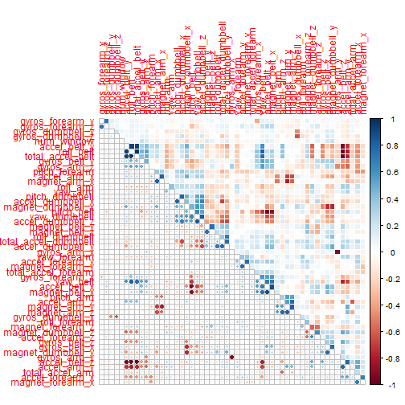
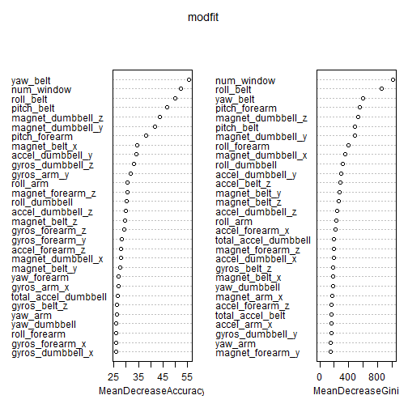

## Introduction
Using devices such as Jawbone Up, Nike FuelBand, and Fitbit it is now possible to collect a large amount of data about personal activity relatively inexpensively. These type of devices are part of the quantified self movement - a group of enthusiasts who take measurements about themselves regularly to improve their health, to find patterns in their behavior, or because they are tech geeks. One thing that people regularly do is quantify how much of a particular activity they do, but they rarely quantify how well they do it. In this project, the goal will be to use data from accelerometers on the belt, forearm, arm, and dumbell of 6 participants. They were asked to perform barbell lifts correctly and incorrectly in 5 different ways. More information is available from the website here: [http://groupware.les.inf.puc-rio.br/har](http://groupware.les.inf.puc-rio.br/har) (see the section on the Weight Lifting Exercise Dataset). 


## Objective
The purpose of this analysis is to predict the manner in which each participant did the exercise. The prediction outcome is determined by **classe** variable in the training set.  


## Getting and Cleaning Data
Before we can do any analysis, we have to make sure the data is in a useable state. 

### Data
The training data for this project is available at: [https://d396qusza40orc.cloudfront.net/predmachlearn/pml-training.csv](https://d396qusza40orc.cloudfront.net/predmachlearn/pml-training.csv)  

The test data for this project is available at: [https://d396qusza40orc.cloudfront.net/predmachlearn/pml-testing.csv](https://d396qusza40orc.cloudfront.net/predmachlearn/pml-testing.csv)  

Below are the steps performed to clean the data:


```r
require(caret)

# read data into dataframe
training <- read.csv('pml-training.csv', na.strings=c("NA","#DIV/0!",""), stringsAsFactors = FALSE)
testing <- read.csv('pml-testing.csv', na.strings=c("NA","#DIV/0!",""), stringsAsFactors = FALSE)

# remove columns where at least 60% of data is missing
trainLimit <- round(dim(training)[1] * 0.6)
testLimit <- round(dim(testing)[1] * 0.6)
training <- training[,colSums(is.na(training)) < trainLimit]
testing <- testing[,colSums(is.na(testing)) < testLimit]

# convert classe to a factor before splitting data
training$classe <- as.factor(training$classe)

# list remaining columns
names(training)
```

```
##  [1] "X"                    "user_name"            "raw_timestamp_part_1"
##  [4] "raw_timestamp_part_2" "cvtd_timestamp"       "new_window"          
##  [7] "num_window"           "roll_belt"            "pitch_belt"          
## [10] "yaw_belt"             "total_accel_belt"     "gyros_belt_x"        
## [13] "gyros_belt_y"         "gyros_belt_z"         "accel_belt_x"        
## [16] "accel_belt_y"         "accel_belt_z"         "magnet_belt_x"       
## [19] "magnet_belt_y"        "magnet_belt_z"        "roll_arm"            
## [22] "pitch_arm"            "yaw_arm"              "total_accel_arm"     
## [25] "gyros_arm_x"          "gyros_arm_y"          "gyros_arm_z"         
## [28] "accel_arm_x"          "accel_arm_y"          "accel_arm_z"         
## [31] "magnet_arm_x"         "magnet_arm_y"         "magnet_arm_z"        
## [34] "roll_dumbbell"        "pitch_dumbbell"       "yaw_dumbbell"        
## [37] "total_accel_dumbbell" "gyros_dumbbell_x"     "gyros_dumbbell_y"    
## [40] "gyros_dumbbell_z"     "accel_dumbbell_x"     "accel_dumbbell_y"    
## [43] "accel_dumbbell_z"     "magnet_dumbbell_x"    "magnet_dumbbell_y"   
## [46] "magnet_dumbbell_z"    "roll_forearm"         "pitch_forearm"       
## [49] "yaw_forearm"          "total_accel_forearm"  "gyros_forearm_x"     
## [52] "gyros_forearm_y"      "gyros_forearm_z"      "accel_forearm_x"     
## [55] "accel_forearm_y"      "accel_forearm_z"      "magnet_forearm_x"    
## [58] "magnet_forearm_y"     "magnet_forearm_z"     "classe"
```

```r
# remove columns not used for prediction
training$X <- NULL
training$user_name <- NULL
training$raw_timestamp_part_1 <- NULL
training$raw_timestamp_part_2 <- NULL
training$cvtd_timestamp <- NULL

# use 75% of training data to build model
set.seed(122015)
indx <- createDataPartition(training$classe, p=0.75, list=FALSE)
subTrain <- training[indx,]
subTest <- training[-indx,]

# identify and remove predictors with little variance,
# since they have minimal impact on predicting output
nzv <- nearZeroVar(subTrain, saveMetrics = TRUE)
subTrain <- subTrain[,nzv$nzv==FALSE]

nzv <- nearZeroVar(subTest, saveMetrics = TRUE)
subTest <- subTest[,nzv$nzv==FALSE]
```

## Data Exploration
Before attempting to build a model, I did some basic data exploration to get a better understanding of the predictor variables. Below is a summary of the exploration done on the predictors: 


```r
require(ggplot2)
require(gridExtra)
require(dplyr)
require(corrplot)

# display summary statistics
summary(subTrain)
```

```
##    num_window    roll_belt        pitch_belt          yaw_belt      
##  Min.   :  1   Min.   :-28.90   Min.   :-55.8000   Min.   :-180.00  
##  1st Qu.:221   1st Qu.:  1.10   1st Qu.:  1.7425   1st Qu.: -88.30  
##  Median :423   Median :113.00   Median :  5.2800   Median : -13.10  
##  Mean   :430   Mean   : 64.28   Mean   :  0.2861   Mean   : -11.21  
##  3rd Qu.:643   3rd Qu.:123.00   3rd Qu.: 14.9000   3rd Qu.:  12.68  
##  Max.   :864   Max.   :162.00   Max.   : 60.3000   Max.   : 179.00  
##  total_accel_belt  gyros_belt_x        gyros_belt_y       gyros_belt_z    
##  Min.   : 0.00    Min.   :-1.000000   Min.   :-0.64000   Min.   :-1.3500  
##  1st Qu.: 3.00    1st Qu.:-0.030000   1st Qu.: 0.00000   1st Qu.:-0.2000  
##  Median :17.00    Median : 0.030000   Median : 0.02000   Median :-0.1000  
##  Mean   :11.29    Mean   :-0.005931   Mean   : 0.03941   Mean   :-0.1297  
##  3rd Qu.:18.00    3rd Qu.: 0.110000   3rd Qu.: 0.11000   3rd Qu.: 0.0000  
##  Max.   :29.00    Max.   : 2.220000   Max.   : 0.63000   Max.   : 1.6200  
##   accel_belt_x     accel_belt_y    accel_belt_z     magnet_belt_x   
##  Min.   :-83.00   Min.   :-69.0   Min.   :-275.00   Min.   :-52.00  
##  1st Qu.:-21.00   1st Qu.:  3.0   1st Qu.:-162.00   1st Qu.:  9.00  
##  Median :-15.00   Median : 34.0   Median :-152.00   Median : 35.00  
##  Mean   : -5.53   Mean   : 30.1   Mean   : -72.41   Mean   : 55.89  
##  3rd Qu.: -5.00   3rd Qu.: 61.0   3rd Qu.:  27.00   3rd Qu.: 60.00  
##  Max.   : 81.00   Max.   :150.0   Max.   : 105.00   Max.   :485.00  
##  magnet_belt_y   magnet_belt_z       roll_arm         pitch_arm      
##  Min.   :354.0   Min.   :-623.0   Min.   :-178.00   Min.   :-87.300  
##  1st Qu.:581.0   1st Qu.:-375.0   1st Qu.: -31.10   1st Qu.:-26.200  
##  Median :601.0   Median :-320.0   Median :   0.00   Median :  0.000  
##  Mean   :593.6   Mean   :-345.4   Mean   :  18.34   Mean   : -4.714  
##  3rd Qu.:610.0   3rd Qu.:-306.0   3rd Qu.:  77.80   3rd Qu.: 11.100  
##  Max.   :673.0   Max.   : 293.0   Max.   : 180.00   Max.   : 88.500  
##     yaw_arm          total_accel_arm  gyros_arm_x        gyros_arm_y     
##  Min.   :-180.0000   Min.   : 1.00   Min.   :-6.37000   Min.   :-3.4000  
##  1st Qu.: -42.7000   1st Qu.:17.00   1st Qu.:-1.35000   1st Qu.:-0.7900  
##  Median :   0.0000   Median :27.00   Median : 0.08000   Median :-0.2400  
##  Mean   :  -0.3365   Mean   :25.51   Mean   : 0.03738   Mean   :-0.2548  
##  3rd Qu.:  45.9000   3rd Qu.:33.00   3rd Qu.: 1.57000   3rd Qu.: 0.1600  
##  Max.   : 180.0000   Max.   :66.00   Max.   : 4.87000   Max.   : 2.8400  
##   gyros_arm_z      accel_arm_x      accel_arm_y       accel_arm_z     
##  Min.   :-2.330   Min.   :-404.0   Min.   :-318.00   Min.   :-636.00  
##  1st Qu.:-0.080   1st Qu.:-240.0   1st Qu.: -54.00   1st Qu.:-144.00  
##  Median : 0.230   Median : -43.0   Median :  14.00   Median : -47.00  
##  Mean   : 0.267   Mean   : -59.3   Mean   :  32.53   Mean   : -71.89  
##  3rd Qu.: 0.720   3rd Qu.:  84.0   3rd Qu.: 139.00   3rd Qu.:  23.00  
##  Max.   : 2.990   Max.   : 435.0   Max.   : 308.00   Max.   : 292.00  
##   magnet_arm_x     magnet_arm_y     magnet_arm_z    roll_dumbbell    
##  Min.   :-580.0   Min.   :-392.0   Min.   :-597.0   Min.   :-153.71  
##  1st Qu.:-299.0   1st Qu.: -12.0   1st Qu.: 124.0   1st Qu.: -19.52  
##  Median : 293.0   Median : 200.0   Median : 443.0   Median :  48.15  
##  Mean   : 193.5   Mean   : 155.6   Mean   : 304.7   Mean   :  23.57  
##  3rd Qu.: 639.0   3rd Qu.: 323.0   3rd Qu.: 544.0   3rd Qu.:  67.36  
##  Max.   : 782.0   Max.   : 583.0   Max.   : 694.0   Max.   : 153.55  
##  pitch_dumbbell     yaw_dumbbell      total_accel_dumbbell
##  Min.   :-149.59   Min.   :-148.766   Min.   : 0.00       
##  1st Qu.: -41.15   1st Qu.: -77.668   1st Qu.: 4.00       
##  Median : -21.36   Median :  -3.552   Median :11.00       
##  Mean   : -11.01   Mean   :   1.617   Mean   :13.76       
##  3rd Qu.:  17.20   3rd Qu.:  79.337   3rd Qu.:20.00       
##  Max.   : 149.40   Max.   : 154.952   Max.   :42.00       
##  gyros_dumbbell_x  gyros_dumbbell_y gyros_dumbbell_z  accel_dumbbell_x 
##  Min.   :-1.9900   Min.   :-2.100   Min.   :-2.3800   Min.   :-237.00  
##  1st Qu.:-0.0300   1st Qu.:-0.140   1st Qu.:-0.3100   1st Qu.: -51.00  
##  Median : 0.1400   Median : 0.030   Median :-0.1300   Median :  -9.00  
##  Mean   : 0.1722   Mean   : 0.041   Mean   :-0.1471   Mean   : -28.88  
##  3rd Qu.: 0.3500   3rd Qu.: 0.210   3rd Qu.: 0.0300   3rd Qu.:  10.00  
##  Max.   : 2.2200   Max.   : 2.730   Max.   : 1.7200   Max.   : 235.00  
##  accel_dumbbell_y  accel_dumbbell_z  magnet_dumbbell_x magnet_dumbbell_y
##  Min.   :-189.00   Min.   :-334.00   Min.   :-643.0    Min.   :-3600.0  
##  1st Qu.:  -9.00   1st Qu.:-142.00   1st Qu.:-535.0    1st Qu.:  231.0  
##  Median :  42.00   Median :  -1.00   Median :-479.0    Median :  310.0  
##  Mean   :  52.61   Mean   : -38.43   Mean   :-328.4    Mean   :  219.4  
##  3rd Qu.: 111.00   3rd Qu.:  38.00   3rd Qu.:-306.0    3rd Qu.:  389.0  
##  Max.   : 315.00   Max.   : 318.00   Max.   : 592.0    Max.   :  633.0  
##  magnet_dumbbell_z  roll_forearm     pitch_forearm      yaw_forearm     
##  Min.   :-262.00   Min.   :-180.00   Min.   :-72.500   Min.   :-180.00  
##  1st Qu.: -45.00   1st Qu.:  -0.67   1st Qu.:  0.000   1st Qu.: -66.40  
##  Median :  14.00   Median :  22.10   Median :  9.205   Median :   0.00  
##  Mean   :  46.42   Mean   :  33.98   Mean   : 10.745   Mean   :  20.28  
##  3rd Qu.:  96.00   3rd Qu.: 140.00   3rd Qu.: 28.500   3rd Qu.: 110.00  
##  Max.   : 447.00   Max.   : 180.00   Max.   : 89.800   Max.   : 180.00  
##  total_accel_forearm gyros_forearm_x  gyros_forearm_y    gyros_forearm_z  
##  Min.   : 0.00       Min.   :-4.950   Min.   :-6.65000   Min.   :-8.0900  
##  1st Qu.:29.00       1st Qu.:-0.220   1st Qu.:-1.46000   1st Qu.:-0.1800  
##  Median :36.00       Median : 0.050   Median : 0.03000   Median : 0.0800  
##  Mean   :34.73       Mean   : 0.161   Mean   : 0.05955   Mean   : 0.1428  
##  3rd Qu.:41.00       3rd Qu.: 0.560   3rd Qu.: 1.64000   3rd Qu.: 0.4900  
##  Max.   :79.00       Max.   : 3.970   Max.   : 6.13000   Max.   : 4.3100  
##  accel_forearm_x   accel_forearm_y  accel_forearm_z   magnet_forearm_x 
##  Min.   :-496.00   Min.   :-595.0   Min.   :-446.00   Min.   :-1280.0  
##  1st Qu.:-179.00   1st Qu.:  61.0   1st Qu.:-181.00   1st Qu.: -618.0  
##  Median : -58.00   Median : 201.0   Median : -41.00   Median : -383.0  
##  Mean   : -62.17   Mean   : 164.3   Mean   : -55.15   Mean   : -315.2  
##  3rd Qu.:  76.00   3rd Qu.: 312.0   3rd Qu.:  26.00   3rd Qu.:  -77.0  
##  Max.   : 477.00   Max.   : 591.0   Max.   : 291.00   Max.   :  666.0  
##  magnet_forearm_y  magnet_forearm_z classe  
##  Min.   :-896.00   Min.   :-973.0   A:4185  
##  1st Qu.:   4.25   1st Qu.: 187.0   B:2848  
##  Median : 591.00   Median : 512.0   C:2567  
##  Mean   : 382.06   Mean   : 392.8   D:2412  
##  3rd Qu.: 737.00   3rd Qu.: 654.0   E:2706  
##  Max.   :1480.00   Max.   :1090.0
```

```r
# generate visualization of correlation matrix
df <- subTrain[-54]
corrplot.mixed(cor(df),lower='circle',upper='color',
               tl.pos='lt',diag='n',order='hclust',hclust.method='complete')
```

 

## Model Building

I decided to use a *random forest* model to determine the output variable due to the following:  
1. This is a classification problem with many predictors     
2. Random Forest models are usually accurate for these type of scenarios    
  


```r
require(randomForest)

# generate model using Random Forest
require(randomForest)
modfit <- randomForest(classe ~ ., data=subTrain, importance=TRUE)

# generate plot to show importance of variables
varImpPlot(modfit)
```

 

### Model Summary 
From the results below, we see the model has a **99.6%** accurracy rate when applied to the test data. Based on this accuracy rate, I expect the model to make the wrong prediction once out of every 250 attempts (1/250 = 4/1000 = 0.4%). 


```r
# generate and display confusion matrix
predictions <- predict(modfit, subTest, type='class')
cmatrix <- confusionMatrix(predictions, subTest$classe)
cmatrix
```

```
## Confusion Matrix and Statistics
## 
##           Reference
## Prediction    A    B    C    D    E
##          A 1394    1    0    0    0
##          B    1  948    5    0    0
##          C    0    0  849    9    0
##          D    0    0    1  795    1
##          E    0    0    0    0  900
## 
## Overall Statistics
##                                           
##                Accuracy : 0.9963          
##                  95% CI : (0.9942, 0.9978)
##     No Information Rate : 0.2845          
##     P-Value [Acc > NIR] : < 2.2e-16       
##                                           
##                   Kappa : 0.9954          
##  Mcnemar's Test P-Value : NA              
## 
## Statistics by Class:
## 
##                      Class: A Class: B Class: C Class: D Class: E
## Sensitivity            0.9993   0.9989   0.9930   0.9888   0.9989
## Specificity            0.9997   0.9985   0.9978   0.9995   1.0000
## Pos Pred Value         0.9993   0.9937   0.9895   0.9975   1.0000
## Neg Pred Value         0.9997   0.9997   0.9985   0.9978   0.9998
## Prevalence             0.2845   0.1935   0.1743   0.1639   0.1837
## Detection Rate         0.2843   0.1933   0.1731   0.1621   0.1835
## Detection Prevalence   0.2845   0.1945   0.1750   0.1625   0.1835
## Balanced Accuracy      0.9995   0.9987   0.9954   0.9942   0.9994
```

## Model Testing


```r
# use model to predict data based based on test data
predictions <- predict(modfit1, dftest, type = 'raw')

# save predictions to file
pml_write_files = function(x){
  n = length(x)
  for(i in 1:n){
    filename = paste0("problem_id_",i,".txt")
    write.table(x[i],file=filename,quote=FALSE,row.names=FALSE,col.names=FALSE)
  }
}

pml_write_files(predictions)
```
